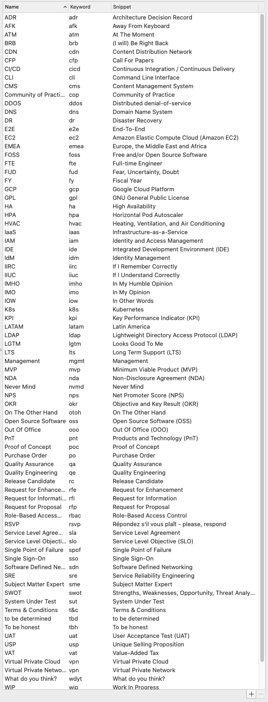
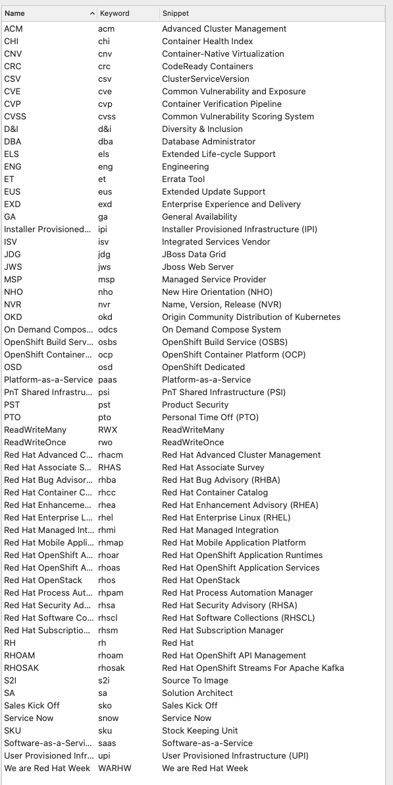
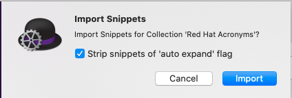
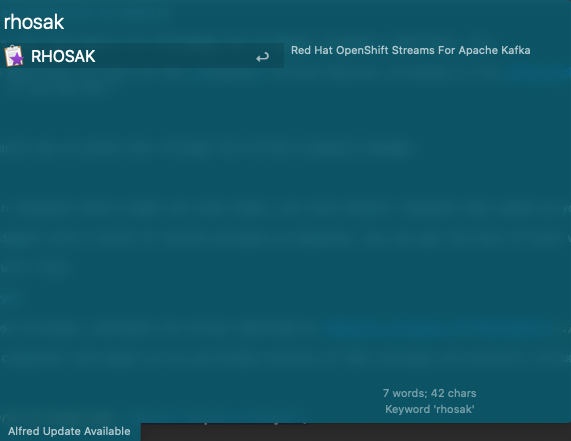

# Alfred Snippets and Workflows by gsaslis 

Productivity Boosts and Time-Savers for Alfredapp.com on MacOS: Snippets, Workflows, etc. 

NOTE: Snippets and Workflows are part of the **premium** Alfred features including in the [Powerpack](https://www.alfredapp.com/powerpack/). 
(Money well spent, if you ask me.) 

## Snippets 

Snippets offer a quick way to paste text through the Alfred clipboard manager. 

### Acronyms

Acronyms are a pain (because others might not know them), but also helpful (because they speed up your typing).  

By using Alfred Snippets with a bunch of stored acronyms as keywords, you can get the best of both worlds! 

In this repo, you will find: 

#### General Acronyms

Some general purpose acronyms, available for direct download as [General_Acronyms.alfredsnippets](./General_Acronyms.alfredsnippets)

Here is a sample screenshot (not meant as an up-to-date version of what acronyms are actually included):

General Acronyms: 

#### Red Hat Acronyms

Some acronyms that probably only make sense for other Red Hatters. 

Available for direct download as [Red_Hat_Acronyms.alfredsnippets](./Red_Hat_Acronyms.alfredsnippets)

Here is a sample screenshot (not meant as an up-to-date version of what acronyms are actually included):

Red Hat Acronyms:

## Usage

1. Download snippets file
2. Open file on Mac (with Alfred installed - including powerpack)
3. Accept "Import Snippets" dialog
   

4. Use your hotkey to open the clipboard manager
5. Type one of your favourite acronyms and click enter.
   

6. Rejoice in using acronyms that sound "like this creature from Dr Who that you see but forgot the second you no longer look at the name it in the eyes".  
